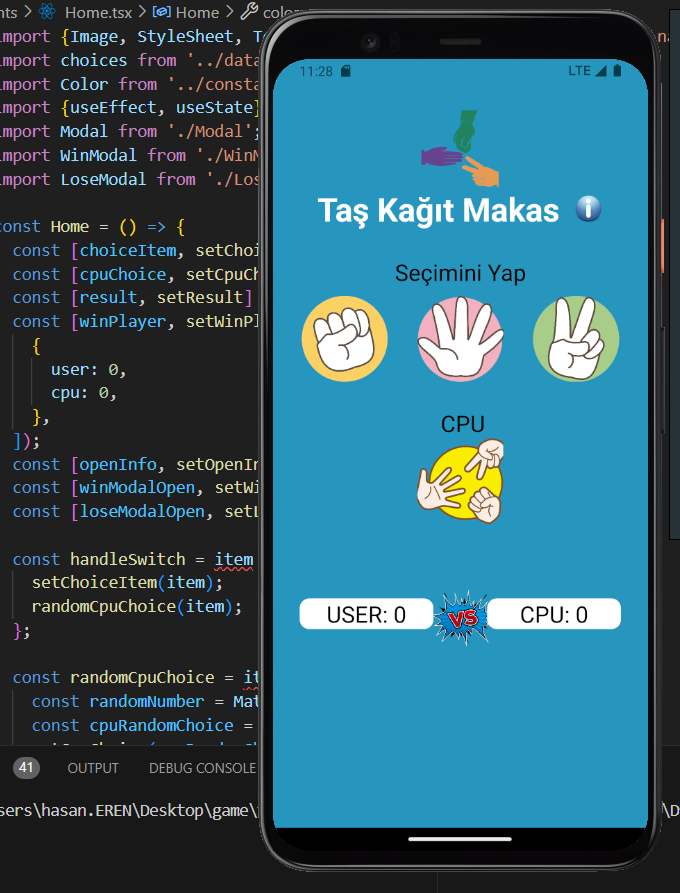

# React-Native Project

# Taş-Kağıt-Makas

- Taş-kâğıt-makas oyunu iki oyuncu ile oynanır. Oyuncu 3 seçenekten
 birini şeçer ve CPU seçimi ile kart karşılaştırılır. Kartların
seçimine göre aşağıdaki koşullara göre oyun sonuçlanır
-- TAŞ, makası kırarak yener.
-- KAĞIT, taşı sararak yener.
-- MAKAS, kağıdı keserek yener.

- Oyunculardan herhangi birinin kazanma skoru 3 olduğunda bu skora ilk
 ulaşan oyunu kazanır. Berabere kalındığında ise skor değişmez.

## Preview

# Tas-Kagit-Makas_ReactNative
